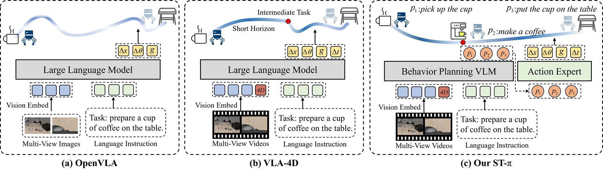

# ST-π: Structured SpatioTemporal VLA for Robotic Manipulation
[Chuanhao Ma](https://chuanhaoma.github.io) $^{1}$,
[Hanyu Zhou](https://hyzhouboy.github.io) $^{2✉}$,
[Shihan Peng](https://pengshihan.com) $^{1}$,
[Yan Li](https://yanyan-li.github.io) $^{2}$,
[Tao Gu](https://taogu.site) $^{3}$,
[Luxin Yan](https://scholar.google.com/citations?user=5CS6T8AAAAAJ) $^{1}$

$^1$ Huazhong University of Science and Technology

$^2$ National University of Singapore

$^3$ Macquarie University

$^✉$ Corresponding Author.

---

## Overview


ST-π is a **structured spatiotemporal Vision-Language-Action (VLA) framework** designed for fine-grained and long-horizon robotic manipulation, explicitly modeling both:

- **Chunk-level task decomposition** (what to do, where, and when)
- **Step-level action generation** (how to execute with spatial coherence and temporal consistency)

---

## TODO
We will release:

- Training & inference code
- DROID-ST construction pipeline
- STAR Dataset

**Stay tuned!**

---

## Citation

If you find this work useful, please consider giving us a star⭐ and citing:

```bibtex
@article{ma2026stpi,
  title={ST-$\pi$: Structured SpatioTemporal VLA for Robotic Manipulation},
  author={Ma, Chuanhao and Zhou, Hanyu and Peng, Shihan and Li, Yan and Gu, Tao and Yan, Luxin},
  journal={arXiv preprint},
  year={2026}
}